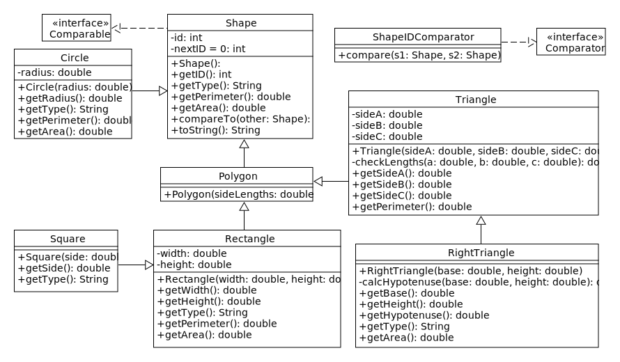

# Lab 6: A Hierarchy of Shapes

In this lab we will practice writing derived classes by implementing the hierarchy shown in the following diagram:

Note that this hierarchy includes abstract classes, concrete classes, and interfaces.
To identify each of these elements, recall the following UML notation:

* An arrow with a solid line indicates inheritance.
The class touching the line extends the class touching the arrowhead.
(See Section 10.1 of our textbook for details.)

* An arrow with a dashed line indicates that a class implements an interface.
(See Section 11.4.)

* Italicised words indicate abstract methods and classes.
(See Section 11.2.)

Below is some additional information about the program.

### Shape

* `Shape()`: The Shape constructor assigns the current value of `nextID` to `id` and then increments `nextID`.
This ensures that every Shape object has a unique ID number.

* `getType()`: This is an abstract method, which means that only the declaration appears in the Shape class.
Override the method in each concrete subclass so that it returns the class name corresponding to an object.

* `compareTo(Shape other)`: Compare this Shape with the given Shape to determine their relative order in a list.
Compare the Shapes first by type, then by perimeter, and then by area.
The Shape with the smaller value should appear first.
(For instance, if two Shapes are both Squares, the one with the smaller perimeter appears first.)
See the [Comparable interface API documentation](https://docs.oracle.com/javase/8/docs/api/java/lang/Comparable.html) for information on the appropriate return values.

### Circle

* `getType()`: Returns the String `"Circle"`.

### Polygon

* `Polygon(double[] sideLengths)`: The constructor is given an array with the length of each side of the Polygon. 
If any length is negative, the constructor throws an IllegalArgumentException.

### Triangle

* `checkLengths(double a, double b, double c)`: If the arguments do not satisfy the [triangle inequality](https://en.wikipedia.org/wiki/Triangle_inequality), throw an IllegalArgumentException.
Otherwise, return the values in an array.
Use this method when calling the parent constructor.
(Recall that `super` must appear on the first line of the child constructor.)

### ShapeIDComparator

* This class implements the [Comparator interface](https://docs.oracle.com/javase/8/docs/api/java/util/Comparator.html).
Comparator objects can be used by methods like those in the Collections class to define alternative orderings for objects.
The sort method, for instance, has two versions: one that takes only a List and one that takes a List and a Comparator.
The first method sorts objects in the List using their compareTo method, which defines the default ordering.
The second method sorts the objects using the compare method of the Comparator.
Write the compare method of this class so that it sorts Shapes by their ID number.
